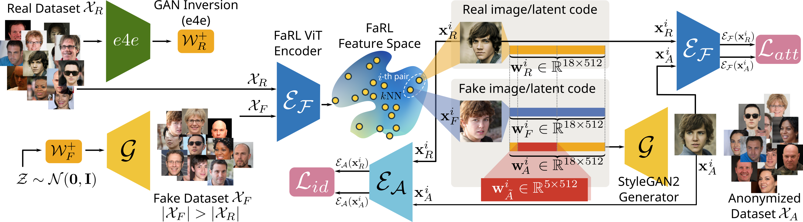
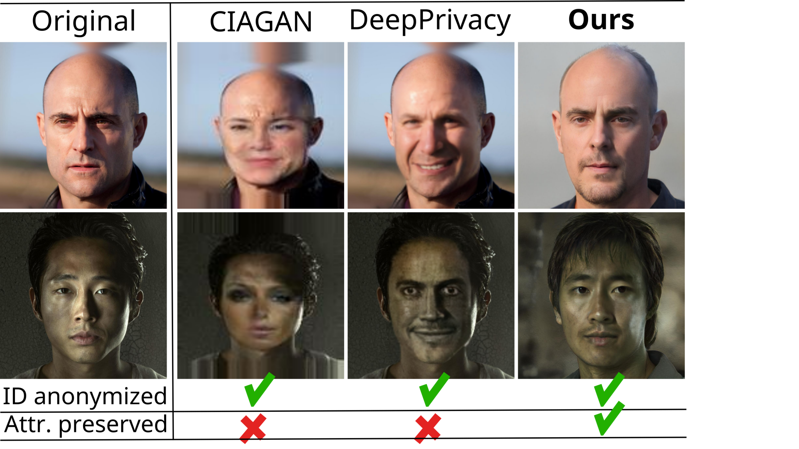

# FALCO: Attribute-preserving Face Dataset Anonymization via Latent Code Optimization.

Authors official PyTorch implementation of the [Attribute-preserving **F**ace Dataset **A**nonymization via **L**atent **C**ode **O**ptimization (CVPR 2023, top-10%)](https://arxiv.org/abs/2303.11296). If you find this code useful for your research, please [cite](#citation) our paper.


<p align="center">

<br><br>

</p>


## Installation

We recommend installing the required packages using python's native virtual environment as follows:

```bash
# Create a virtual environment and activate it
python -m venv falco-venv
source falco-venv/bin/activate

# Upgrade pip and install requirements
pip install --upgrade pip
pip install -r requirements.txt

# Install CLIP (for obtaining the CLIP and FaRL ViT features)
pip install git+https://github.com/openai/CLIP.git
```

For using the aforementioned virtual environment in a Jupyter Notebook, you need to manually add the kernel as follows:

```bash
python -m ipykernel install --user --name=falco-venv
```


## Prerequisite pre-trained models

Download the prerequisite pre-trained models (GAN generators [1], e4e inversion encoder [2], SFD face detector [3], FaRL [4], and ArcFace [5]):

```bash
python download_models.py
```

This will create a directory `models/pretrained` with the following sub-directories (~3.5 GB):

```
./models/pretrained/
├── arcface
│   └── model_ir_se50.pt
├── e4e
│   ├── e4e_ffhq_encode.pt
│   ├── model_ir_se50.pth
│   └── shape_predictor_68_face_landmarks.dat
├── farl
│   ├── FaRL-Base-Patch16-LAIONFace20M-ep16.pth
│   └── FaRL-Base-Patch16-LAIONFace20M-ep64.pth
├── genforce
│   ├── stylegan2_ffhq512.pth
│   └── stylegan2_ffhq1024.pth
└── sfd
    └── s3fd-619a316812.pth
```

Not that the required pre-trained CLIP [6] and DINO [7] models will be downloaded automatically upon request.


## Datasets

Please see [here](doc/datasets.md) for a brief description of each real dataset used and guidelines on how to download and store them.


## Anonymization process

### Step 1: Real images feature extraction: `extract_features.py`

Extract features (in the CLIP [6] and/or FaRL [4] and/or DINO [7] and/or ArcFace [5] feature spaces) for the images in a given real dataset using the following script:

```bash
extract_features.py [-h] [-v] --dataset {celeba,celebahq,lfw} [--dataset-root DATASET_ROOT] [--batch-size BATCH_SIZE] [--no-clip] [--no-farl] [--no-dino] [--no-arcface] [--cuda] [--no-cuda]

Real dataset feature extraction in the CLIP/FaRL/DINO/ArcFace spaces.

options:
  -h, --help            show this help message and exit
  -v, --verbose         verbose mode on
  --dataset {celeba,celebahq,lfw}
                        choose real dataset
  --dataset-root DATASET_ROOT
                        set dataset root directory
  --batch-size BATCH_SIZE
                        set batch size
  --no-clip             do NOT extract CLIP features
  --no-farl             do NOT extract FaRL features
  --no-dino             do NOT extract DINO features
  --no-arcface          do NOT extract ArcFace features
  --cuda                use CUDA during training
  --no-cuda             do NOT use CUDA during training
```

Upon completion, the features will be stored under `datasets/features/<dataset>/` directory. For example,

```bash
python extract_features.py -v --dataset=celebahq --batch-size=128
```

will extract all features and store them as follows:

```bash
datasets/features/celebahq/
├── arcface_features.pt
├── clip_features.pt
├── dino_features.pt
├── farl_features.pt
└── image_filenames.txt
```


### Step 2: Fake dataset creation: `create_fake_dataset.py`

In order to create a pool of fake images, along with their latent codes in W+/S spaces and feature representations in the CLIP [6] and/or FaRL [4] and/or DINO [7] and/or ArcFace [5] spaces, use the following script: 

```bash
create_fake_dataset.py [-h] [-v] [--gan {stylegan2_ffhq1024,stylegan2_ffhq512}] [--truncation TRUNCATION] [--num-samples NUM_SAMPLES] [--no-clip] [--no-farl] [--no-dino] [--no-arcface] [--cuda] [--no-cuda]

Create a fake image dataset using a pre-trained GAN generator.

options:
  -h, --help            show this help message and exit
  -v, --verbose         verbose mode on
  --gan {stylegan2_ffhq1024,stylegan2_ffhq512}
                        pre-trained GAN generator
  --truncation TRUNCATION
                        W-space truncation parameter
  --num-samples NUM_SAMPLES
                        number of latent codes to sample
  --no-clip             do NOT extract CLIP features
  --no-farl             do NOT extract FaRL features
  --no-dino             do NOT extract DINO features
  --no-arcface          do NOT extract ArcFace features
  --cuda                use CUDA during training
  --no-cuda             do NOT use CUDA during training
```

The generated images along with the corresponding latent codes and features will be stored under `datasets/fake/`. For example, 

```bash
python create_fake_dataset.py -v --num-samples=60000
```

will generate 60,000 images/latent codes/features and will store them under `datasets/fake/fake_dataset_stylegan2_ffhq1024-0.7-11000-CLIP-FaRL-DINO-ArcFace`. 


### Step 3: Nearest neighbor pairing: `pair_nn.py` 

In order to find the nearest fake neighbor of each image in a given real dataset, use the following script:

```bash
pair_nn.py [-h] [-v] --real-dataset {celeba,celebahq,lfw} [--fake-dataset-root FAKE_DATASET_ROOT] [--algorithm {auto,ball_tree,kd_tree,brute,all}] [--metric {euclidean,cosine,all}] [--cuda] [--no-cuda]

Pair each image of a given real dataset with an image of a given fake dataset

options:
  -h, --help            show this help message and exit
  -v, --verbose         verbose mode on
  --real-dataset {celeba,celebahq,lfw}
                        real dataset
  --fake-dataset-root FAKE_DATASET_ROOT
                        TODO
  --algorithm {auto,ball_tree,kd_tree,brute,all}
                        set algorithm used to compute the nearest neighbors
  --metric {euclidean,cosine,all}
                        metric to use for distance computation
  --cuda                use CUDA during training
  --no-cuda             do NOT use CUDA during training
```

Upon completion, NN map files (i.e., dictionaries that map each real image to a fake one) are stored under `<fake_dataset_root>`.

For example, in order to assign to each image in the CelebA-HQ dataset to a fake NN from the fake dataset created in the example above (i.e., `datasets/fake/fake_dataset_stylegan2_ffhq1024-0.7-60000-CLIP-FaRL-DINO-ArcFace/`), for all available feature representations (i.e., CLIP [6], FaRL [4], DINO [7], and ArcFace [5]) and using the `auto` NN algorithm and the `euclidean`/`cosine` metrics, run:

```bash
python pair_nn.py -v --real-dataset=celebahq --fake-dataset-root=datasets/fake/fake_dataset_stylegan2_ffhq1024-0.7-60000-CLIP-FaRL-DINO-ArcFace/ --algorithm=auto
```

Upon completion the following files will be stored under `datasets/fake/fake_dataset_stylegan2_ffhq1024-0.7-60000-CLIP-FaRL-DINO-ArcFace/`:

```bash
datasets/fake_dataset_stylegan2_ffhq1024-0.7-60000-CLIP-FaRL-DINO-ArcFace/arcface_auto_euclidean_nn_map_celebahq.json
datasets/fake_dataset_stylegan2_ffhq1024-0.7-60000-CLIP-FaRL-DINO-ArcFace/clip_auto_euclidean_nn_map_celebahq.json
datasets/fake_dataset_stylegan2_ffhq1024-0.7-60000-CLIP-FaRL-DINO-ArcFace/dino_auto_euclidean_nn_map_celebahq.json
datasets/fake_dataset_stylegan2_ffhq1024-0.7-60000-CLIP-FaRL-DINO-ArcFace/farl_auto_euclidean_nn_map_celebahq.json
datasets/fake_dataset_stylegan2_ffhq1024-0.7-60000-CLIP-FaRL-DINO-ArcFace/arcface_auto_cosine_nn_map_celebahq.json
datasets/fake_dataset_stylegan2_ffhq1024-0.7-60000-CLIP-FaRL-DINO-ArcFace/clip_auto_cosine_nn_map_celebahq.json
datasets/fake_dataset_stylegan2_ffhq1024-0.7-60000-CLIP-FaRL-DINO-ArcFace/dino_auto_cosine_nn_map_celebahq.json
datasets/fake_dataset_stylegan2_ffhq1024-0.7-60000-CLIP-FaRL-DINO-ArcFace/farl_auto_cosine_nn_map_celebahq.json
```

In case you get the following error,

```
OpenBLAS warning: precompiled NUM_THREADS exceeded, adding auxiliary array for thread metadata.
OpenBLAS : Program is Terminated. Because you tried to allocate too many memory regions. This library was built to support a maximum of 128 threads - either rebuild OpenBLAS with a larger NUM_THREADS value or set the environment variable OPENBLAS_NUM_THREADS to a sufficiently small number. This error typically occurs when the software that relies on OpenBLAS calls BLAS functions from many threads in parallel, or when your computer has more cpu cores than what OpenBLAS was configured to handle. OpenBLAS : Program is Terminated. Because you tried to allocate too many memory regions.
```

try to set `OPENBLAS_NUM_THREADS` to a sufficiently small number, e.g., `OPENBLAS_NUM_THREADS=32` and re-run as follows:

```bash
OPENBLAS_NUM_THREADS=32 python pair_nn.py -v --real-dataset=celebahq --fake-dataset-root=datasets/fake/fake_dataset_stylegan2_ffhq1024-0.7-60000-CLIP-FaRL-DINO-ArcFace/ --algorithm=auto
```


#### Original and fake (NN) data visualization

Note that at this point, you may **visualize** the real dataset along with its NN fake images using the visualization script shown below (i.e., `visualize_dataset.py`). For example, using the fake dataset generated in the above examples, you may visualize the CelebA-HQ dataset along with fake NNs found in the FaRL features space as follows:

```bash
python visualize_dataset.py -v --dataset=celebahq --fake-nn-map=datasets/fake/fake_dataset_stylegan2_ffhq1024-0.7-60000-CLIP-FaRL-DINO-ArcFace/farl_auto_cosine_nn_map_celebahq.json
```

- [ ] Add figure


### Step 4: Real images inversion: `invert.py`

In order to invert the images of a given real dataset, use the following script:

```bash
invert.py [-h] [-v] --dataset {celeba,celebahq,lfw} [--dataset-root DATASET_ROOT] [--batch-size BATCH_SIZE] [--save-aligned-images] [--dont-save-aligned-images]
                 [--save-reconstructed-images] [--dont-save-reconstructed-images] [--cuda] [--no-cuda]

Real dataset GAN inversion script.

options:
  -h, --help            show this help message and exit
  -v, --verbose         verbose mode on
  --dataset {celeba,celebahq,lfw}
                        choose real dataset
  --dataset-root DATASET_ROOT
                        set dataset root directory
  --batch-size BATCH_SIZE
                        set generation batch size
  --save-aligned-images
                        save aligned images
  --dont-save-aligned-images
                        do NOT save aligned images
  --save-reconstructed-images
                        save reconstructed images
  --dont-save-reconstructed-images
                        do NOT save reconstructed images
  --cuda                use CUDA during training
  --no-cuda             do NOT use CUDA during training
```

Upon completion, the inverted dataset are stored under `<dataset_root>/inv/` following the structure of the original real dataset. For example, in order to invert the CelebA-HQ dataset, run:

```bash
python invert.py -v --dataset=celebahq
```

Given that CelebA-HQ is stored under `datasets/CelebA-HQ`, the inverted dataset will be stored under `datasets/inv/celebahq/`.

#### Original, fake NN, and inverted data visualization

Note that at this point, you may **visualize** the real dataset along with its e4e inversions and NN fake images using the visualization script shown below (i.e., `visualize_dataset.py`). For example, using the fake dataset generated in the above examples, you may visualize the CelebA-HQ dataset along with its inversions and fake NNs found in the FaRL features space as follows:

```bash
python visualize_dataset.py -v --dataset=celebahq --fake-nn-map=datasets/fake/fake_dataset_stylegan2_ffhq1024-0.7-60000-CLIP-FaRL-DINO-ArcFace/farl_auto_cosine_nn_map_celebahq.json --inv
```

- [ ] Add figure


### Step 5: Anonymization training script: `anon_train.py` 

In order to anonymize the images of a given real dataset, use the following script:

```bash
anonymize.py [-h] [-v] --dataset {celeba,celebahq,lfw} [--dataset-root DATASET_ROOT] [--subset {train,val,test,train+val,train+val+test}] --fake-nn-map FAKE_NN_MAP
                            [--latent-space {W+,S}] [-m ID_MARGIN] [--epochs EPOCHS] [--optim {sgd,adam}] [--lr LR] [--lr-milestones LR_MILESTONES [LR_MILESTONES ...]]
                            [--lr-gamma LR_GAMMA] [--lambda-id LAMBDA_ID] [--lambda-attr LAMBDA_ATTR] [--cuda] [--no-cuda]

options:
  -h, --help            show this help message and exit
  -v, --verbose         verbose mode on
  --dataset {celeba,celebahq,lfw}
                        choose real dataset
  --dataset-root DATASET_ROOT
                        set dataset root directory
  --subset {train,val,test,train+val,train+val+test}
                        choose dataset's subset
  --fake-nn-map FAKE_NN_MAP
                        fake NN map file (created by `pair_nn.py`)
  --latent-space {W+,S}
                        StyleGAN2's latent space
  -m ID_MARGIN, --id-margin ID_MARGIN
                        identity loss margin
  --epochs EPOCHS       Number of anonymization steps
  --optim {sgd,adam}    set optimizer ('sgd' or 'adam')
  --lr LR               Learning rate
  --lr-milestones LR_MILESTONES [LR_MILESTONES ...]
                        learning rate scheduler milestones
  --lr-gamma LR_GAMMA   learning rate decay parameter
  --lambda-id LAMBDA_ID
                        Scaling parameter of the ID loss
  --lambda-attr LAMBDA_ATTR
                        Scaling parameter of the attribute loss
  --cuda                use CUDA during training
  --no-cuda             do NOT use CUDA during training
```

Upon completion,  the anonymized dataset are stored under `<dataset_root>/anon/` following the structure of the original real dataset.

#### Original, fake NN, inverted, and anonymized data visualization

Note that at this point, you may **visualize** the real dataset along with its e4e inversions, the NN fake images, and the anonymized images using the visualization script shown below (i.e., `visualize_dataset.py`). For example, using the fake dataset generated in the above examples, you may visualize the CelebA-HQ dataset along with its inversions, the fake NNs found in the FaRL features space, and the anonymized images as follows:

```bash
python visualize_dataset.py -v --dataset=celebahq --fake-nn-map=datasets/fake/fake_dataset_stylegan2_ffhq1024-0.7-60000-CLIP-FaRL-DINO-ArcFace/farl_auto_cosine_nn_map_celebahq.json --inv --anon=datasets/anon/celebahq/celebahq-train+val+test_anon_W+_m-0.5_lambda-id-10.0_lambda-attr-0.1_adam-0.01_epochs-50_farl_auto_cosine_nn_map_celebahq/
```

- [ ] Add figure


## Citation

```bibtex
@InProceedings{falco2023cvpr,
    author    = {Barattin, Simone and Tzelepis, Christos and Patras, Ioannis and Sebe, Nicu},
    title     = {Attribute-preserving Face Dataset Anonymization via Latent Code Optimization},
    booktitle = {Proceedings of the IEEE Conference on Computer Vision and Pattern Recognition (CVPR)},
    month     = {June},
    year      = {2023},
}
```


## References

[1] https://genforce.github.io/

[2] Tov, O., Alaluf, Y., Nitzan, Y.,  Patashnik, O., & Cohen-Or, D. (2021). Designing an encoder for  stylegan image manipulation. *ACM Transactions on Graphics (TOG)*, *40*(4), 1-14.

[3] Zhang, S., Zhu, X., Lei, Z., Shi, H., Wang, X., & Li, S. Z. (2017). S3fd: Single shot scale-invariant face detector. In *Proceedings of the IEEE international conference on computer vision* (pp. 192-201).

[4] Zheng, Y., Yang, H., Zhang, T., Bao,  J., Chen, D., Huang, Y., ... & Wen, F. (2022). General facial  representation learning in a visual-linguistic manner. In *Proceedings of the IEEE/CVF Conference on Computer Vision and Pattern Recognition* (pp. 18697-18709).

[5] Deng, J., Guo, J., Xue, N., & Zafeiriou, S. (2019). Arcface: Additive angular margin loss for deep face recognition. In *Proceedings of the IEEE/CVF conference on computer vision and pattern recognition* (pp. 4690-4699).

[6] Radford, A., Kim, J. W., Hallacy, C.,  Ramesh, A., Goh, G., Agarwal, S., ... & Sutskever, I. (2021, July).  Learning transferable visual models from natural language supervision.  In *International conference on machine learning* (pp. 8748-8763). PMLR.

[7] Caron, M., Touvron, H., Misra, I.,  Jégou, H., Mairal, J., Bojanowski, P., & Joulin, A. (2021). Emerging properties in self-supervised vision transformers. In *Proceedings of the IEEE/CVF international conference on computer vision* (pp. 9650-9660).


## Acknowledgment

This research was supported by the EU's Horizon 2020 programme H2020-951911 [AI4Media](https://www.ai4media.eu/) project.

